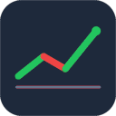

# CodingView

Keep an eye on your portfolio without leaving the editor: CodingView shows live stock and
cryptocurrency prices in a VS Code status bar item at the bottom of the window.



## Quick start

1. Install the extension (`F5` in this repository, or `code --install-extension codingview-0.1.0.vsix`).
2. Run **CodingView: Add Symbol** from the command palette and enter a symbol such as `cn:600519`.
3. The status bar starts rotating through your watchlist every 5 seconds and refreshes prices every 60 seconds.

## Symbol format

Every entry uses an explicit market prefix:

| Market | Example | Notes |
| --- | --- | --- |
| China A-shares | `cn:600519` | 6 digits; `sh`, `sz` and `bj` prefixes are derived from the code |
| Hong Kong stocks | `hk:00700` | Up to 5 digits, zero-padded, so `hk:700` works too |
| US stocks | `us:AAPL` | Dots are allowed for share classes, for example `us:BRK.B` |
| Crypto | `crypto:BTCUSDT` | Any Binance spot pair, for example `crypto:BTCUSDT` |

## Commands

| Command | What it does |
| --- | --- |
| `CodingView: Add Symbol` | Validates the input and appends it to `codingview.watchlist` |
| `CodingView: Remove Symbol` | Picks an entry from the quick pick and removes it |
| `CodingView: Refresh Now` | Fetches quotes immediately |
| `CodingView: Show Watchlist` | Lists every symbol with its price; picking one rotates the status bar to it |
| `CodingView: Next Symbol` | Advances the rotation manually |

## Settings

| Setting | Default | Description |
| --- | --- | --- |
| `codingview.watchlist` | `[]` | Symbols to track, using the format above |
| `codingview.refreshIntervalSeconds` | `60` | Quote refresh interval, minimum 15 |
| `codingview.rotateIntervalSeconds` | `5` | Status bar rotation interval, minimum 2 |
| `codingview.requestTimeoutSeconds` | `8` | Provider request timeout before failover, 2–60 |
| `codingview.colorByDirection` | `true` | Green when up, red when down |
| `codingview.provider` | `auto` | `auto`, `tencent`, `sina` or `binance-vision` |

`auto` tries Tencent first, falls back to Sina for stocks, and uses Binance Vision for crypto.
Failures back off at 60, 120, 240 and then 300 seconds while keeping the last known prices on screen.

## Data sources and privacy

No API key, account or telemetry is involved. Requests go straight from VS Code to these public
endpoints, and nothing is sent to any server owned by this project:

- `qt.gtimg.cn` for A-shares, Hong Kong and US stocks (GBK encoded, batched up to 50 symbols per request)
- `hq.sinajs.cn` as the stock fallback, which requires a `finance.sina.com.cn` Referer header
- `data-api.binance.vision` for crypto (the `api.binance.com` main site is unreachable on some networks)

These are unofficial endpoints without an SLA, so fields may change. US quotes can be delayed.

## Development

```bash
npm install
npm run compile   # tsc --noEmit plus an esbuild bundle into dist/
npm run watch     # incremental bundle while debugging
npm run lint      # ESLint over src/
npm test          # Vitest unit tests
npm run verify:live   # ask the real endpoints for one symbol per market
npm run package   # produce a .vsix with vsce
```

Press `F5` to launch the Extension Development Host. `scripts/generate-icon.mjs` regenerates
`media/icon.png` when the artwork needs to change.

## Design documents

See [`docs/`](docs/README.md) for the architecture, data-source details, configuration reference,
test strategy, release process, decision log and roadmap.

## Known limitations

- The watchlist is a flat symbol list; there is no holdings or profit/loss tracking.
- Hong Kong listings are not supported yet.
- Invalid symbols stay in the list and show `--` in the status bar.

## License

MIT
