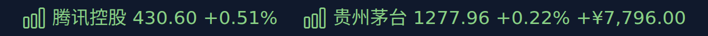
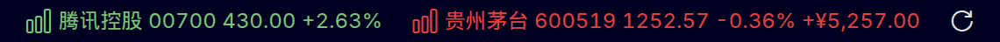

# CodingView

[](https://github.com/bot66/codingview-vscode/releases/latest)
[](https://github.com/bot66/codingview-vscode/actions/workflows/ci.yml)

Live stock and cryptocurrency quotes in the VS Code status bar, so you can follow your portfolio
without leaving the editor.



*Captured from a development build: `hk:00700` is pinned, `cn:600519` rotates in with its profit and
loss because the entry carries a quantity and a cost. Each item reads `name code price change`.*



## Highlights

- **One glanceable item** that rotates through the watchlist, plus an optional pinned symbol that
  never moves.
- **Four markets**: mainland China A-shares, Hong Kong, US stocks and crypto spot pairs.
- **Keyless by default** (Tencent, Sina, Binance Vision and Gate.io). Add a free Finnhub key for US
  quotes if you want a second opinion on that market.
- **Profit and loss** for the entries where you record a quantity and average cost.
- **Stale-aware**: keep the last price behind a `$(warning)` marker, with failover between sources
  and backoff on repeated failures.

## Install

Download the `.vsix` from the [latest release](https://github.com/bot66/codingview-vscode/releases/latest)
and install it:

```bash
code --install-extension codingview-<version>.vsix
```

The Extensions view's `...` menu → **Install from VSIX…** does the same thing. CodingView is *not*
published to the Visual Studio Marketplace: releases are GitHub Release assets, and this repository
is the only distribution channel. `npm run package` builds the same `.vsix` locally, and `F5` runs
the extension from source.

**Upgrading from 0.2.0:** uninstall the old build first (`code --uninstall-extension tgc.codingview`).
That release shipped under the publisher id `tgc`, this one under `bot66`, and VS Code treats the two
as separate extensions: with both enabled the duplicate command registration makes the new build fail
to activate, so its commands look like they are missing. Reload the window afterwards.

Then run **CodingView: Add Symbol** from the command palette and enter a symbol such as `cn:600519`.
The status bar starts rotating through the watchlist every 5 seconds and refreshes prices every 60
seconds.

## Symbols

| Market | Example | Notes |
| --- | --- | --- |
| China A-shares | `cn:600519` | 6 digits; `sh`, `sz` and `bj` prefixes are derived from the code |
| Hong Kong stocks | `hk:00700` | Up to 5 digits, zero-padded, so `hk:700` works too |
| US stocks | `us:AAPL` | Dots are allowed for share classes, for example `us:BRK.B` |
| Crypto | `crypto:BTCUSDT` | Binance first, Gate.io as the fallback |
| Crypto, pinned to a source | `crypto:gate:LITUSDT` | For a coin whose ticker another listing also uses |

Two coins can share a ticker: `crypto:LITUSDT` is a Binance listing, while Lighter trades on Gate.io
(as `LIT_USDT` in Gate's own spelling). Run **CodingView: Search Crypto**, type `lighter`, and pick
the coin from a list that shows its name, contract address and live price — the extension then writes
the unambiguous `crypto:gate:LITUSDT` into the watchlist, spelled like every other pair. Full
write-up: [docs/crypto-identity.md](docs/crypto-identity.md).

## Holdings

Replace an entry with an object to record a position. Both fields are required:

```jsonc
"codingview.watchlist": [
  "us:AAPL",
  { "symbol": "cn:600519", "quantity": 100, "cost": 1500 }
]
```

**CodingView: Set Holding** writes that object for you and asks for the numbers. The status bar then
shows the profit for the symbol on screen, and the tooltip gains a `P/L` column for every held
symbol.

## Commands

| Command | What it does |
| --- | --- |
| `CodingView: Add Symbol` | Validates the input and appends it to `codingview.watchlist` |
| `CodingView: Search Crypto` | Finds a coin by name or ticker and adds it as `crypto:gate:<PAIR>` |
| `CodingView: Remove Symbol` | Picks an entry from the quick pick and removes it |
| `CodingView: Refresh Now` | Fetches quotes immediately |
| `CodingView: Show Watchlist` | Lists every symbol with its price; picking one rotates the status bar to it |
| `CodingView: Next Symbol` | Advances the rotation manually |
| `CodingView: Pin Symbol` | Keeps one symbol in its own status bar item, next to the rotation |
| `CodingView: Set Holding` | Records the quantity and average cost for a symbol, for profit and loss |
| `CodingView: Set API Key` | Stores a Finnhub key in the OS keychain for US quotes |

## Settings

| Setting | Default | Description |
| --- | --- | --- |
| `codingview.watchlist` | `[]` | Symbols to track, using the format above; entries may carry `quantity` and `cost` |
| `codingview.refreshIntervalSeconds` | `60` | Quote refresh interval, minimum 15 |
| `codingview.rotateIntervalSeconds` | `5` | Status bar rotation interval, minimum 2 |
| `codingview.requestTimeoutSeconds` | `8` | How long a provider has to answer before the next one is tried, 2–60 |
| `codingview.colorByDirection` | `true` | Green when up, red when down |
| `codingview.provider` | `auto` | `auto`, `finnhub`, `tencent`, `sina`, `binance-vision` or `gate` |
| `codingview.pinnedSymbol` | `''` | A symbol that stays visible instead of rotating |

`auto` uses Finnhub when a key is stored, otherwise it starts at Tencent, falls back to Sina for
stocks, and tries Binance Vision before Gate.io for crypto. A provider that fails twice in a row is
skipped for the next three cycles, failures back off at 60, 120, 240 and then 300 seconds, and the
last known prices stay on screen. Invalid entries never break the item: they are listed in the
tooltip with a **Remove** link.

## Data sources and privacy

Finnhub is optional and off until you store a key with **CodingView: Set API Key**; the key is kept
in the OS keychain through `SecretStorage` and sent as a header, never in a URL. Otherwise no key,
account or telemetry is involved. Requests go straight from VS Code to these public endpoints, and
nothing is sent to any server owned by this project:

- `finnhub.io` for US stocks, when a key is stored
- `qt.gtimg.cn` for A-shares, Hong Kong and US stocks (GBK encoded, batched up to 50 symbols per request)
- `hq.sinajs.cn` as the stock fallback, which requires a `finance.sina.com.cn` Referer header
- `data-api.binance.vision` for crypto (the `api.binance.com` main site is unreachable on some networks)
- `api.gateio.ws` for crypto pairs pinned with `crypto:gate:<PAIR>` and for the coin search

These are unofficial endpoints without an SLA, so fields may change. US quotes can be delayed by the
source, and the tooltip says so. Suspended instruments show `Halted` instead of a price.

## Development

```bash
npm install
npm run compile       # tsc --noEmit plus an esbuild bundle into dist/
npm run watch         # incremental bundle while debugging
npm run lint          # ESLint over src/
npm test              # Vitest unit tests
npm run test:smoke    # @vscode/test-cli suite in a real extension host
npm run verify:live   # ask the real endpoints for one symbol per market
npm run media         # regenerate media/statusbar.png and media/rotation.gif
npm run package       # produce a .vsix with vsce
```

Press `F5` to launch the Extension Development Host. `scripts/generate-icon.mjs` regenerates
`media/icon.png`; `scripts/generate-screenshots.mjs` drives a real editor window over the DevTools
protocol to capture the README artwork.

## Design documents

See [`docs/`](docs/README.md) for the architecture, data-source details, configuration reference,
test strategy, release process, decision log and roadmap.

## License

MIT
